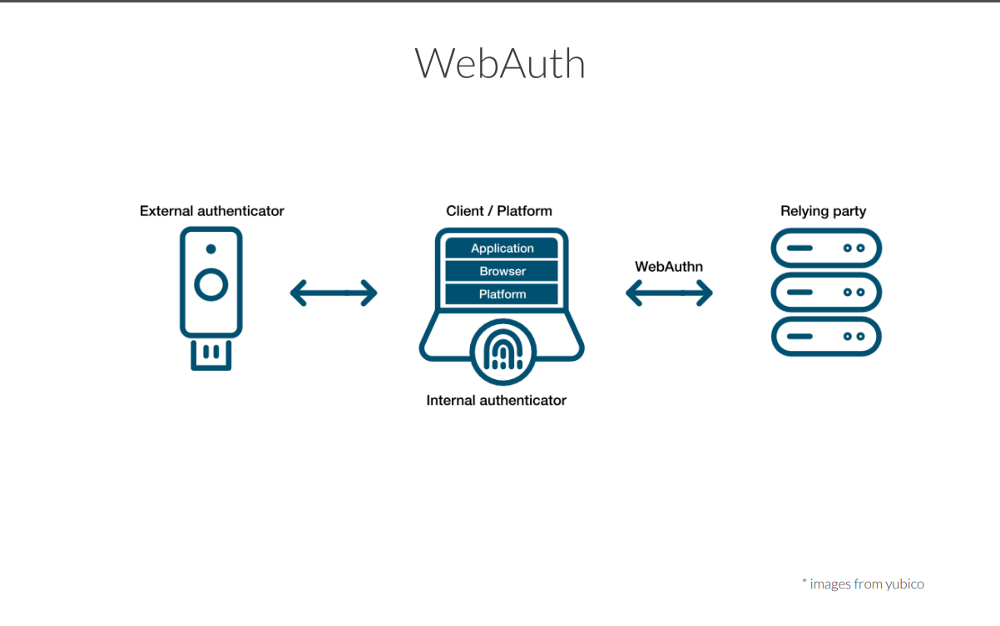

# Usage

- First clone project locally
- Go to [Sign In With Google Setup](https://developers.google.com/identity/gsi/web/guides/overview) and register a project first
- Create a .env file and include a VITE_GOOGLE_CLIENT_ID variable with your google client ID for the project you created
- Then cd into /frontend and /backend folder & run npm install
- Lastly run the backend and the frontend

# Overview

This monorepo contains code that implements a classic login flow, federated Authentication with Google, and also incorporates an identifies-first flow using WebAuthn:

WebAuthn is a browser API that empowers us all to secure our accounts with a user-friendly experience powered by public-key cryptography.

- [@simplewebauthn](https://simplewebauthn.dev/docs/)

Here is a diagram that shows how the WebAuthn works in theory.

<figure>
    
    <figcaption>WebAuth flow diagram 1. Image source: - <a href="https://firtman.github.io/authentication/slides.pdf">link</a>
 </figcaption>
</figure>

<figure>
    
    <figcaption>WebAuth flow diagram 1. Image source: - <a href="https://firtman.github.io/authentication/slides.pdf">link</a>
 </figcaption>
</figure>
